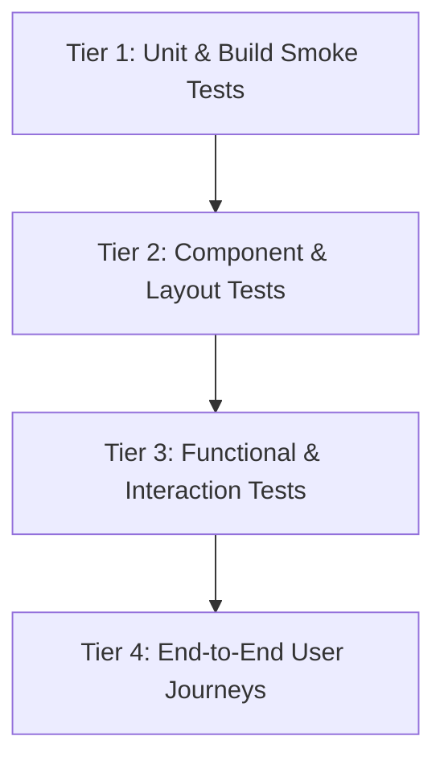

# Specification & Verification Report: PART-TIME Marketplace Rebuild

**Document ID**: SPEC-PARTTIME-2026-09-14  
**Author**: Spec Miner Survey 3  
**Target Platform**: Next.js (App Router), TypeScript, Tailwind CSS  
**Source Specifications**: `ORIGINAL_REQUEST.md`, `PRD.md`, and Legacy Prototype (`data.js`, `app.js`, `index.html`, `styles.css`)

---

## 1. Executive Specification Overview & Scope

The PART-TIME platform is a hyper-local shift and gig marketplace engineered to solve immediate micro-staffing shortages (cafés, retail stores, event coordinators, promotional agencies, logistics) while providing flexible job seekers (students, freelancers) with instant shift discovery, mutual attendance verification via One-Time PIN (`OTP 6767`), and instant digital cashout via simulated UPI rails.

The Next.js rebuild mandates:
- **Dual-Experience Viewport Layout**: Desktop Web (>= 1024px) full-width multi-pane split-map dashboard with zero mobile phone frame wrappers; Mobile Web (< 768px) touch-first app with 5-tab bottom navigation dock, swipeable bottom sheets, and >= 44x44px touch targets.
- **Design System**: Uber-dominant utility aesthetic (high-contrast typography, monochrome base, functional safety accents), Apple tactile motion (spring physics, backdrop blur), and Raycast precision (1px border contrasts `rgba(255,255,255,0.08–0.16)`).
- **Core Functional Engine**: Real-time search & taxonomy filtering (6 categories, 4 wage tiers ₹100–₹10,000), Interactive Radar Map with location beacon and radius filtering (1–25 km), Universal OTP 6767 check-in flow, Holographic Wallet with UPI cashout (GPay/PhonePe/Paytm), and +HIRE employer shift posting.
- **Production Integrity**: Next.js App Router, strict TypeScript interfaces, Tailwind CSS, zero ESLint/TS errors (`npm run build`), and clean dev server on `localhost:3000`.

---

## 2. Complete Feature Inventory & User Stories

### 2.1 User Stories

| Story ID | Persona | User Story | Acceptance Criteria Summary |
|---|---|---|---|
| **US-01** | Job Seeker | As a student/worker, I want to search and filter local shifts by category and wage tier so that I find relevant gigs nearby within seconds. | Dynamic search input updates listings immediately; category chips filter jobs; empty state displays when 0 results. |
| **US-02** | Job Seeker | As a worker, I want to explore an interactive radar map with wage markers and radius controls so that I visually assess opportunities around my current location. | Live radar with pulsing user beacon; clickable wage pins open contextual preview sheet; radius changes (1, 5, 10, 25 km). |
| **US-03** | Job Seeker | As a worker, I want to apply to shifts and check in using a universal OTP code (`6767`) so that my attendance and pay eligibility are locked tamper-free on-site. | Apply modal presents OTP 6767; copyable OTP in header; chat action chip shares PIN 6767 with employer receiving automated confirmation; logs to Recent Activity. |
| **US-04** | Job Seeker | As a worker, I want to view my holographic wallet balance and cash out funds instantly to UPI (Google Pay, PhonePe, Paytm) so that I receive same-day earnings. | Specular wallet card displays baseline balance (₹1,000); cashout modal accepts custom amounts/presets; verifies balance & UPI format; updates balance and logs transaction. |
| **US-05** | Employer | As a café manager or event lead, I want to post a new shift via a "+ HIRE" modal in under 60 seconds so that nearby workers see and apply for urgent vacancies immediately. | Modal captures title, category, wage, duration, slots, location, notes; validates fields; prepends job to Home feed and Radar map dynamically. |
| **US-06** | Cross-Platform User | As a desktop user, I want a spacious, multi-column dashboard with a split-pane map and side inspection panels without mobile mockup wrappers. | Screens >= 1024px render full-width split view; no phone chassis, buttons, or artificial device frames. |
| **US-07** | Mobile User | As a smartphone user, I want a touch-optimized mobile experience with a sticky bottom navigation dock and large touch targets. | Screens < 768px render sticky 5-tab dock; touch targets >= 44x44px; bottom sheet dialogs; compact header. |
| **US-08** | All Users | As a user, I want consistent sensory feedback (visual toasts, Web Audio chimes, theme toggling) so that interactions feel physical and responsive. | Web Audio synthesized tap, success, and cashout tones; non-intrusive toast notifications; Black Crystal and Light Crystal theme toggle. |

---

## Features Discovered

| # | Category | Feature | Description | Inputs | Outputs | Error Behavior | Discovered Via |
|---|---|---|---|---|---|---|---|
| 1 | Architecture | Dual Viewport Engine | Separate layout trees for desktop (>= 1024px multi-pane) and mobile (< 768px bottom dock). | Window resize / media query (`min-width: 1024px`, `max-width: 767px`) | Tailored desktop dashboard or mobile app shell | No layout break; responsive transition without frame artifact on desktop | ORIGINAL_REQUEST R1, PRD §3 |
| 2 | Navigation | 5-Tab Navigation Dock | Sticky mobile navigation bar supporting Home, Map, Chat, Recent, Wallet with unread badges. | Tab tap / click (`data-view`) | Active view panel transition, updates URL/state | Invalid view ID falls back to Home | PRD §3, index.html line 372 |
| 3 | Visual System | Black Crystal Theme | Stark pitch-black onyx (`#000000`) theme with Raycast 1px borders (`rgba(255,255,255,0.16)`) and cyan/purple glow. | Theme toggle click or `data-theme="dark"` | CSS variable assignment across surface, border, and text tokens | Falls back to dark theme if localStorage invalid | PRD §5.2, styles.css lines 5-47 |
| 4 | Visual System | Light Crystal Theme | Soft daylight alabaster (`#f1f5f9`) theme with high-contrast text (`#0f172a`) and sapphire/indigo accents. | Theme toggle click or `data-theme="light"` | Recomputes CSS variable tokens on root document | Reverts to dark theme on error | PRD §5.2, styles.css lines 49-67 |
| 5 | Audio Engine | Procedural Web Audio Synthesizer | Zero-dependency Web Audio oscillator generating synthetic click/tap, success arpeggio, and cashout chime. | Trigger method (`playTap`, `playSuccess`, `playCashout`), sound enabled flag | AudioContext playback through destination speakers | Fails silently without crashing if AudioContext blocked/unsupported | app.js lines 23-101 |
| 6 | Identity & KYC | KYC Age Verification Banner & Modal | Enforces legal threshold (Age >= 18), displays Aadhaar/ID status, allows switching between Employee and Employer roles. | Role select, minimum/maximum hourly rate inputs, save button | Updated UserProfile state, toast confirmation | Non-numeric hourly rate clamped or rejected | PRD §4.1, index.html lines 411-459 |
| 7 | Discovery | Real-Time Search Bar | Instant keyword filtering over job title, employer, category, and location with clear button. | Keyboard text input, clear button click | Filtered list of matching job cards, live count text | Empty search query restores all jobs; no match renders empty state | ORIGINAL_REQUEST R3, app.js lines 199-224 |
| 8 | Discovery | Category Taxonomy Chips | Horizontal scrolling filter chips: 'All Opportunities', 'Café & Food', 'Promo & Sales', 'Events & Ushers', 'Logistics & Expo', 'Retail Store', 'Express Delivery'. | Chip tap / click (`data-category`) | Active chip highlight, filters feed to selected category | Unknown category defaults to 'All' | PRD §4.2, data.js lines 71-197 |
| 9 | Discovery | Standardized Wage Cards | Job cards displaying standardized wage badges (₹100 micro, ₹500 half-day, ₹1,000 standard, ₹10,000 multi-day), distance, rating, duration, and action buttons. | Job vacancy record | Rendered card with Apply Now and Quick Chat buttons | Missing optional tags omitted cleanly | ORIGINAL_REQUEST R3, PRD §4.2 |
| 10 | Application | Quick Apply & OTP Confirmation Modal | Modal displaying job summary, employer details, and prominent "Instant Check-in Handshake PIN: 6767". | Apply button click on card or map sheet | Opens confirmation dialog with job brief and OTP 6767 | Disables submission if job ID invalid | app.js lines 577-624, index.html lines 564-585 |
| 11 | Radar Map | Animated Scanning Radar Grid | Concentric range rings with rotating CSS radar sweep animation centered on user coordinates. | Map view active | Animated radar sweep overlay | Degrades to static grid if reduced motion requested | PRD §4.4, styles.css lines 1120-1160 |
| 12 | Radar Map | "You Are Here" Location Beacon | Pulsing concentric beacon marker indicating current geolocated position with text badge. | Map coordinates | Animated pulsing beacon element | Fixed fallback coordinates (center map) | PRD §4.4, index.html lines 198-203 |
| 13 | Radar Map | Geo-Tagged Wage Pins | Holographic interactive pins plotted across map space displaying wage amount (₹100, ₹500, ₹1k, ₹10k) and employer tag. | Job coordinates (`coords.x`, `coords.y`) | Rendered pin elements on radar grid | Coordinates clamped within map boundary (5%–95%) | PRD §4.4, app.js lines 303-320 |
| 14 | Radar Map | Slide-up Job Preview Sheet | Contextual bottom sheet opening on pin click displaying employer avatar, rating, wage, location, Quick Apply, and Chat buttons. | Pin click event | Animated slide-up card with job details | Closes on backdrop tap or outside click | PRD §4.4, index.html lines 208-232 |
| 15 | Radar Map | Radius Filter Control | Cycling or sliding control adjusting scanning radius between 1 km, 5 km, 10 km, and 25 km. | Radius selector click / drag | Updates active radius state, text badge, and toast feedback | Wraps around radius array on overflow | PRD §4.4, app.js lines 769-780 |
| 16 | On-Site Security | Universal Handshake OTP 6767 | Fixed tamper-resistant check-in PIN displayed in status banner, copyable to clipboard on click. | Click on OTP banner badge | Copies "6767" to clipboard, triggers toast and tap sound | Falls back to alert/toast if Clipboard API denied | PRD §4.3, app.js lines 732-736 |
| 17 | On-Site Security | Live Shift Activity Tracker | Dynamic Island widget expanding from compact pill into live shift countdown (`"Arun's Cafe • In 35m • PIN 6767"`) with audio equalizer bars. | Tap on Dynamic Island pill | Expands/collapses live activity card with animated equalizer | Retains collapsed state if inactive | PRD §5.3, index.html lines 55-76 |
| 18 | Communication | In-App Messaging Directory | Pre-populated employer conversations (Arun, Akhila, Ryan, Toby) with search filter, online indicators, and unread counts. | Chat search input, contact selection | Active thread switch, updates unread counter | Empty search returns full contact list | PRD §4.5, data.js lines 200-313 |
| 19 | Communication | Dynamic Chat Stream & Quick Chips | Message thread supporting outgoing/incoming messages and 3 quick-action chips (`"🔑 Share PIN 6767"`, `"📍 I've Arrived"`, `"💰 Request Pay"`). | Text input or quick chip click | Sends message bubble; triggers simulated employer response after 1400ms | Ignores whitespace-only messages | PRD §4.5, app.js lines 433-473 |
| 20 | Communication | Automated Shift Payout Trigger | Clicking `"💰 Request Pay"` chip in chat triggers employer confirmation and auto-credits ₹500 to wallet. | Quick chip click with text containing 'Request Pay' | Injects credit transaction into wallet, updates balance, plays success sound | None; automated settlement succeeds | app.js lines 457-462 |
| 21 | Shift History | Recent Activities Ledger | Chronological timeline of shifts categorized by status (Completed/Settled, Scheduled, Under Review) showing wage, date, and PIN used. | Recent activity data array | Rendered cards with status pills (emerald, cyan, amber) | Displays empty state placeholder if no entries | PRD §4.6, app.js lines 476-493 |
| 22 | Wallet | Holographic Glass Wallet Card | Specular glass card displaying current available balance (₹1,000 baseline), user name, KYC verification tag, and UPI VPA (`alexchen@okaxis`). | Wallet state (`balance`, `upiId`, `userName`) | Visual holographic card element | Balance formatted with Unicode Indian Rupee symbol `₹` | PRD §4.7, index.html lines 314-339 |
| 23 | Wallet | Deposit / Add Money Simulation | Quick action button simulating immediate bank transfer credit (+₹500) from linked bank (HDFC Bank •••• 4091). | "Add Money" button click | Increases wallet balance by ₹500, adds credit transaction to ledger, shows toast | None; simulated deposit always succeeds | app.js lines 818-821 |
| 24 | Wallet | Instant UPI Cashout Modal | Modal supporting cashout to Google Pay, PhonePe, or Paytm with preset chips (₹200, ₹500, ₹1,000) and custom amount. | Amount input, UPI VPA string, Confirm Cashout button click | Decrements balance, logs debit transaction, plays cashout chord, displays success toast | Validates amount > 0, amount <= balance, and valid UPI ID containing '@' | PRD §4.7, app.js lines 539-574 |
| 25 | Wallet | Transaction Ledger | Historical ledger listing all credit/debit transactions with status ("Completed"), date, category, and formatted amount. | Wallet transactions array | Chronological transaction rows with green/red amount indicators | Empty list shows placeholder message | PRD §4.7, app.js lines 502-521 |
| 26 | Employer Flow | +HIRE Shift Creation Modal | Employer modal capturing Job Title, Category, Wage (₹), Duration, Slots Available, Location, and Description. | Form input submission (`submit` event) | Prepends new JobVacancy to jobs state, renders in feed and map, shows toast, resets form | Requires title, wage > 0, duration, and location; displays HTML5 validation errors | PRD §4.8, app.js lines 627-667 |
| 27 | Notifications | In-App Notification Center | Slide-over / modal listing recent system alerts (payment credited, PIN active, application accepted, KYC verified) with unread badge. | Header bell icon click | Rendered list of alert cards; unread badge clears or updates | Empty list displays "No notifications" | index.html lines 519-526, app.js lines 669-691 |
| 28 | Settings | System Settings Modal | Modal providing appearance theme toggle, sound effects toggle, KYC reverification link, and sign-out simulation. | Settings icon click, toggle buttons | Toggles theme/sound, triggers toast feedback | Closes safely on close button or backdrop click | index.html lines 586-627, app.js lines 886-899 |

---

## 3. Verification Specifications for Core Capabilities

### 3.1 Build Integrity & Toolchain Specification
- **Framework & Runtime**: Next.js App Router (version >= 14/15/16) running on Node.js 18+.
- **Language & Type Checking**: TypeScript in strict mode (`"strict": true` in `tsconfig.json`). Zero implicit `any` types. All domain models (`JobVacancy`, `UserProfile`, `WalletTransaction`, `ChatMessage`, `RecentActivity`, `NotificationItem`) explicitly declared.
- **Styling**: Tailwind CSS configured with custom color tokens matching the Liquid Glass palette (`#000000` pitch black onyx, `rgba(255,255,255,0.08–0.16)` borders, `accent-cyan: #06b6d4`, `accent-emerald: #10b981`, `accent-violet: #8b5cf6`).
- **Verification Command 1**: `npm run build` must exit with code 0 and emit zero TypeScript compiler errors (`tsc --noEmit`) and zero ESLint errors (`next lint`).
- **Verification Command 2**: `npm run dev` must successfully bind to `http://localhost:3000` without unhandled runtime exceptions or SSR hydration mismatch warnings in the browser console.

### 3.2 Desktop vs. Mobile Viewport Separation Specification
- **Desktop Web (Breakpoints >= 1024px)**:
  - Layout: Full-width, multi-pane dashboard utilizing the entire screen width.
  - Map Pane: Split-pane interactive radar map permanently or semi-permanently visible side-by-side with job opportunity listings or side-sheet inspection.
  - Zero Phone Frames: Absolutely no mock mobile chassis, iPhone bezels, titanium frame borders, or fake hardware volume/power buttons.
  - Navigation: Top persistent header with search, filters, category tabs, and action buttons (`+ HIRE`, Notifications, Profile).
- **Mobile Web (Breakpoints < 768px)**:
  - Layout: Dedicated touch-first mobile application layout taking 100% of viewport width and height.
  - Navigation: Sticky bottom navigation dock with 5 tabs (Home, Map, Chat, Recent, Wallet) with icons, labels, and badges.
  - Touch Ergonomics: All interactive touch targets (buttons, inputs, tabs, category chips, quick reply pills) strictly adhere to **minimum 44px x 44px** hit area.
  - Modal & Sheet Ergonomics: Slide-up bottom sheets for job inspection, quick apply, and cashout with swipe-down dismissal gestures.
- **Tablet / Intermediate Viewports (768px to 1023px)**:
  - Fluid responsive grid adapting single-pane or stacked layouts cleanly without overflow or clipped controls.

### 3.3 Real-Time Search & Filtering Specification
- **Search Input**:
  - Performs case-insensitive substring matching across `title`, `employer`, `category`, `location`, and `tags`.
  - Clears instantly via dedicated clear button (`✕`) when query is present.
  - Updates results in real time as the user types without requiring form submission.
- **Category Filter**:
  - Horizontal chip row: `All`, `Café & Food`, `Promo & Sales`, `Events & Ushers`, `Logistics & Expo`, `Retail Store`, `Express Delivery`.
  - Active chip has distinctive visual state (glow, background contrast).
  - Tapping a chip immediately updates the list; 'All' clears category constraint.
- **Wage Tier Vacancies**:
  - Visible categorization across standardized tiers: ₹100 (micro-tasks), ₹500 (half-day), ₹1,000 (standard shifts), ₹10,000 (multi-day contracts).
- **Count & Empty State**:
  - Dynamic indicator: `"Showing X gigs nearby"`.
  - Zero results state: Renders friendly empty-state card with search icon, message, and suggestion to reset filters.

### 3.4 Interactive Radar Map Specification
- **Scanning Grid & User Beacon**:
  - Circular radar display with rotating sweep animation.
  - Animated pulsing concentric beacon labeled `"You are Here"` positioned at user's virtual coordinates.
- **Wage Pins**:
  - Geo-tagged pins positioned by normalized coordinates (`coords.x%`, `coords.y%`).
  - Badge shows wage value (e.g. `₹500`, `₹1k`, `₹10k`) and truncated employer name.
  - Category-specific color accents (cyan, amber, emerald, purple, rose).
- **Pin Interaction**:
  - Clicking any pin displays a slide-up preview sheet containing employer avatar, name, rating, job title, distance, wage badge, `"Quick Apply (PIN 6767)"` button, and `"Chat"` button.
- **Radius Control**:
  - Interactive radius control toggling or sliding between 1 km, 5 km, 10 km, and 25 km.
  - Updates radar boundary indication and emits toast feedback (`"Radar scanning within X km radius"`).

### 3.5 Mutual Handshake with OTP 6767 Check-in & Active Tracking
- **Handshake Protocol**:
  - Universal prototype check-in code is strictly `6767`.
  - Displayed prominently in the status banner with a click-to-copy handler that copies `"6767"` to clipboard and triggers confirmation toast.
  - Displayed in the Quick Apply confirmation modal as the designated arrival handshake.
- **Chat Verification Action**:
  - In-app chat includes quick-reply chip `"🔑 Share PIN 6767"`.
  - Tapping chip posts message into thread; employer responds automatically within ~1.4 seconds with: `"PIN 6767 confirmed! Shift checked in successfully. Have a great shift!"`.
- **Active Shift State Tracking**:
  - Check-in confirmation transitions shift to active state.
  - Live activity widget (Dynamic Island or top banner) activates, showing active shift title, start countdown, and live equalizer.
  - Logged into Recent Activities under status `"Scheduled"` or `"Confirmed"` with `pinUsed: "6767"`.

### 3.6 Holographic Wallet Balance, Receipts & Simulated UPI Cashout
- **Wallet Card Display**:
  - Specular glass styling displaying available balance (baseline ₹1,000).
  - Displays user name (`ALEX CHEN`), KYC status (`KYC VERIFIED ≥ 18`), and linked UPI ID (`alexchen@okaxis`).
- **Deposit Simulation**:
  - `"Add Money"` action immediately credits ₹500 to wallet balance and prepends `"Shift Payout / Bank Deposit"` credit entry to ledger.
- **Simulated UPI Cashout Flow**:
  - Modal provides amount input and preset chips (`₹200`, `₹500`, `₹1,000`).
  - Displays linked payment rail logos/text: Google Pay (GPay), PhonePe, Paytm.
  - Validation Rules:
    - Amount must be a positive integer > 0.
    - Amount must not exceed available wallet balance (`amount <= balance`). If violated, displays error toast: `"Insufficient balance. Maximum: ₹X"`.
    - UPI ID must be non-empty and contain `@` (e.g., `user@upi`). If invalid, displays error toast: `"Please enter a valid UPI ID (e.g. name@okaxis)"`.
  - Upon valid submission:
    - Wallet balance decrements immediately by `amount`.
    - Ledger unshifts a new transaction of type `debit`, category `"GPay / UPI Withdrawal"`, status `"Completed"`.
    - Procedural Web Audio cashout chord plays.
    - Modal closes and success toast appears: `"₹X successfully sent to [UPI ID] via Google Pay!"`.

### 3.7 +HIRE Employer Shift Posting Modal
- **Modal Trigger**: Accessible via prominent `+ HIRE` button in desktop header and mobile navigation bar.
- **Form Fields & Validation**:
  - `Job Title / Role`: text, required (e.g., "Weekend Cafe Barista").
  - `Category`: select dropdown with options: `Café & Food`, `Promotion`, `Events`, `Logistics`, `Retail`, `Delivery`.
  - `Wage (₹)`: number, required, min 1 (e.g., 500).
  - `Duration`: text, required (e.g., "4 Hours").
  - `Slots Available`: number, min 1 (default 2).
  - `Location / Landmark`: text, required (e.g., "Indiranagar 100ft Road").
  - `Description & Shift Notes`: textarea, optional.
- **Submission Behavior**:
  - Validates all required fields; prevents submission if empty.
  - Synthesizes a new `JobVacancy` object with unique ID (`job-[timestamp]`), employer name (`[User Name]'s Enterprise`), coordinates (`coords.x`, `coords.y`), and checkInPin `"6767"`.
  - Prepends job to the global job listings state.
  - Immediately updates Home feed job cards and plots a new pin on the Radar map without page reload.
  - Plays success chime, closes modal, resets form, and emits toast notification: `"Vacancy [Title] published live for ₹[Wage]!"`.

---

## 4. Test Tier Mapping (Tiers 1–4)

### 4.1 Tier 1: Unit & Build Smoke Tests
- **T1.1 Build Compilation**: Verify `npm run build` exits with code 0.
- **T1.2 Type Correctness**: Verify `tsc --noEmit` returns zero TypeScript errors.
- **T1.3 Code Quality & Linting**: Verify `next lint` executes with zero warnings/errors.
- **T1.4 Data Model Validation**: Verify interface contracts for `JobVacancy`, `UserProfile`, `WalletTransaction`, `ChatMessage`, `NotificationItem`.
- **T1.5 Formatting Helpers**: Test currency formatter (`₹` prefix, thousands separators), distance string formatter (`X.X km away`), and time relative formatter.
- **T1.6 UPI Validation Regex**: Test regex `^[\w.\-_]{2,256}@[a-zA-Z]{2,64}$` against valid (`alex@okaxis`, `user.99@hdfcbank`) and invalid inputs (`alex`, `alex@`, `@axis`, ` `).
- **T1.7 Web Audio Fallback**: Verify sound synthesizer initializes safely when `AudioContext` is undefined or suspended in headless environments.

### 4.2 Tier 2: Component & Viewport Layout Tests
- **T2.1 Desktop Layout Structure (>= 1024px)**:
  - Test at 1280x800 and 1920x1080 viewports.
  - Verify full-width multi-pane layout renders.
  - Verify split-pane map and job listings display concurrently.
  - Verify **absence** of iPhone 15 frame wrappers, titanium chassis, and hardware button elements.
- **T2.2 Mobile Layout Structure (< 768px)**:
  - Test at 375x667 (iPhone SE) and 393x852 (iPhone 15 Pro) viewports.
  - Verify sticky bottom navigation dock renders with 5 tab buttons.
  - Verify touch target dimensions: `element.getBoundingClientRect()` width >= 44px and height >= 44px for all buttons, chips, and inputs.
  - Verify modals render as touch-friendly bottom sheets.
- **T2.3 Theme Switcher**:
  - Verify toggling theme applies `data-theme="light"` and `data-theme="dark"` on `<html>`.
  - Verify computed styles for background, card surface, and text colors match design tokens.

### 4.3 Tier 3: Functional & Interaction Integration Tests
- **T3.1 Search Input Filtering**:
  - Type "Cafe" -> list updates to show only café jobs.
  - Type "Indiranagar" -> list filters by location.
  - Click clear button -> input clears, all jobs restored.
  - Type nonexistent string "xyzqwerty" -> empty state card displayed.
- **T3.2 Category Chip Filtering**:
  - Click "Events & Ushers" -> list filters to event jobs.
  - Click "All Gigs" -> resets filter to all categories.
- **T3.3 Combined Search and Category**:
  - Select "Cafe" chip and type "Barista" -> only Barista Cafe job returned.
- **T3.4 Radar Map Pin & Sheet Interaction**:
  - Verify pins render with correct wage text (₹100, ₹500, ₹1k, ₹10k).
  - Click pin -> slide-up sheet opens with matching job title, employer, and wage.
  - Click "Quick Apply" on sheet -> opens Quick Apply modal.
  - Click "Chat" on sheet -> navigates to Chat tab and selects employer thread.
- **T3.5 Map Radius Cycling**:
  - Click radius control -> cycles 1 km -> 5 km -> 10 km -> 25 km -> 1 km.
- **T3.6 OTP 6767 Clipboard & Application**:
  - Click OTP banner -> clipboard contains "6767" and toast confirms.
  - Open Apply modal -> shows "PIN: 6767" -> confirm -> job added to Recent Activity with `pinUsed: "6767"`.
- **T3.7 In-App Chat Flow**:
  - Select chat contact (Arun) -> thread displays past messages.
  - Click `"🔑 Share PIN 6767"` -> message sent -> employer reply arrives after timeout with check-in confirmation.
  - Click `"💰 Request Pay"` -> message sent -> employer approves ₹500 -> wallet balance increments by ₹500.
- **T3.8 Wallet Balance & Cashout**:
  - Initial balance verified at ₹1,000.
  - Click "Add Money" -> balance becomes ₹1,500, credit transaction logged.
  - Open Cashout modal -> select preset ₹500 -> enter valid UPI -> submit -> balance becomes ₹1,000, debit transaction logged.
  - Attempt cashout of ₹2,000 (exceeding balance) -> error toast displayed, balance unchanged.
  - Attempt cashout with invalid UPI (`alexaxis`) -> error toast displayed, balance unchanged.
  - Attempt cashout with amount = 0 or -100 -> error toast displayed.
- **T3.9 +HIRE Shift Creation**:
  - Open `+ HIRE` modal -> fill required fields -> submit.
  - Verify new job card appears at top of Home feed.
  - Verify new pin appears on Radar map.
  - Verify modal closes and form resets.

### 4.4 Tier 4: End-to-End User Journeys
- **T4.1 Complete Shift Worker Lifecycle**:
  1. Worker opens platform on mobile viewport (393px).
  2. Searches for "Barista", selects "Café & Food" category chip.
  3. Clicks job card -> inspects details in Apply modal.
  4. Confirms application with OTP 6767.
  5. Navigates to Chat tab -> taps `"🔑 Share PIN 6767"` chip.
  6. Receives employer check-in confirmation reply.
  7. Taps `"💰 Request Pay"` chip -> receives ₹500 payment confirmation.
  8. Navigates to Wallet tab -> verifies balance incremented to ₹1,500.
  9. Opens Cashout modal -> withdraws ₹500 to GPay (`alexchen@okaxis`).
  10. Verifies balance decremented to ₹1,000 and debit receipt present in ledger.
- **T4.2 Complete Employer Shift Posting Lifecycle**:
  1. Employer opens platform on desktop viewport (1280px).
  2. Clicks `+ HIRE` button in top navigation.
  3. Enters Title "Rush Hour Espresso Barista", Category "Café & Food", Wage ₹600, Duration "3 Hours", Slots 2, Location "Koramangala 5th Block".
  4. Submits vacancy.
  5. Verifies new vacancy card immediately appears in listings.
  6. Verifies split-pane Radar map immediately plots a new pin for the job.
- **T4.3 Viewport Responsiveness Transition**:
  1. Load app in desktop viewport (1200px): Verify full-width split view, no phone frames.
  2. Dynamically resize window down to 375px: Verify layout shifts seamlessly to mobile shell with bottom dock, touch targets >= 44px, and modal sheets.

---

## Edge Cases

| # | Feature | Input | Observed Behavior |
|---|---|---|---|
| 1 | Search Bar | Special characters: `!@#$%^&*()_+` | Handled safely via string comparison without regex crash; returns 0 matches and displays empty state. |
| 2 | Search Bar | Indian Rupee Symbol: `₹500` or `1000` | Normalized or matched against wage properties; returns appropriate wage matches without character encoding glitches. |
| 3 | Search Bar | Leading and trailing whitespaces: `"   cafe   "` | Trimmed before filtering; accurately matches "Cafe" jobs. |
| 4 | Search Bar | Extremely long input string (> 200 characters) | Input handled without layout overflow or DOM freezing; yields empty state. |
| 5 | Category Filter | Rapid sequential clicking across all category chips | UI handles state changes synchronously; active chip indicator updates cleanly without race conditions. |
| 6 | Radar Map | Map radius set to 1 km when no jobs are within 1 km | Radar displays user beacon and scanning animation; zero pins rendered without map breaking. |
| 7 | Radar Map | Jobs with identical coordinates | Stacked pins slightly offset or top pin clickable; sheet reveals job details cleanly. |
| 8 | Handshake OTP | Clipboard API blocked or permission denied by browser | Catches Promise rejection; displays fallback toast with PIN 6767 without unhandled error. |
| 9 | In-App Chat | User submits empty string or whitespace-only message | Input submission ignored; no empty chat bubble created. |
| 10 | In-App Chat | User rapidly clicks `"🔑 Share PIN 6767"` multiple times | Each message logged; simulated reply debounced or queued without breaking chat thread. |
| 11 | In-App Chat | User sends custom text mentioning "6767" or "PIN" | Triggers affirmative check-in response from employer bot. |
| 12 | In-App Chat | User sends custom text mentioning "Request Pay" | Triggers wage release response and adds ₹500 credit to wallet state. |
| 13 | Wallet Cashout | Amount input is 0 | Rejected with validation toast `"Please enter a valid cashout amount"`; balance preserved. |
| 14 | Wallet Cashout | Amount input is negative (e.g., `-250`) | Rejected with validation toast; balance preserved. |
| 15 | Wallet Cashout | Amount input exceeds available balance (e.g., `₹5,000` when balance is `₹1,000`) | Rejected with error toast `"Insufficient balance. Maximum: ₹1,000"`; balance preserved. |
| 16 | Wallet Cashout | Amount input equals exact total balance (`₹1,000`) | Approved; wallet balance becomes `₹0`; debit transaction logged; card reflects `₹0`. |
| 17 | Wallet Cashout | UPI ID string lacks `@` symbol (e.g., `alexchen.okaxis`) | Rejected with error toast `"Please enter a valid UPI ID (e.g. name@okaxis)"`; balance preserved. |
| 18 | Wallet Cashout | UPI ID string is empty or whitespace | Rejected with validation toast; balance preserved. |
| 19 | Wallet Deposit | User repeatedly clicks "Add Money" | Successive ₹500 increments added reliably; transactions list appends entries with unique IDs. |
| 20 | +HIRE Modal | Submitting with empty Job Title or Location | HTML5 / React form validation halts submission; highlights missing fields. |
| 21 | +HIRE Modal | Submitting with Wage = 0 or negative wage | Input rejects or validation alerts user; prevents zero-wage job creation. |
| 22 | +HIRE Modal | Submitting with non-numeric slots or slots < 1 | Clamped to minimum 1 slot. |
| 23 | +HIRE Modal | Job Description containing HTML/script tags | Sanitized and rendered as plain text in card details, preventing XSS. |
| 24 | Viewport Resizing | Viewport toggled across 1024px boundary | Fluid reflow; desktop split view appears without mobile wrapper; mobile view shows bottom dock. |
| 25 | Viewport Resizing | Viewport toggled across 768px boundary | Touch targets maintain >= 44px; bottom sheet dialogs transform to modal dialogs. |
| 26 | Web Audio | Browser policy requires user gesture before AudioContext play | AudioContext resumes on first click/touch event; no audio error in console. |
| 27 | Dynamic Island | Tapping Dynamic Island when no shift is active | Displays default status indicator or shifts countdown without crashing. |
| 28 | LocalStorage | Browser in Private / Incognito mode blocking localStorage | Fallback to in-memory state for theme and profile without unhandled exception. |

---

## 5. Implementation Recommendations for Build Phase

1. **Component Architecture**:
   - Establish `/components/desktop/DesktopLayout.tsx` and `/components/mobile/MobileLayout.tsx` governed by a responsive layout provider or CSS media query container to strictly segregate the desktop split-pane experience from the mobile dock experience.
   - Prohibit wrapping desktop views in phone mockups or frame borders.
2. **State Management**:
   - Centralize marketplace state (jobs, active filters, wallet balance, transactions, chat threads, current user) in a typed React Context or lightweight Zustand store to ensure seamless reactivity across Home feed, Map, Chat, and Wallet.
3. **Audio Synthesis**:
   - Encapsulate the Web Audio API sound engine in a modular hook (`useSoundEngine`) with safe lazy initialization upon first user gesture.
4. **Validation & Typing**:
   - Enforce Zod or TypeScript schemas on +HIRE inputs and Cashout inputs to guarantee zero runtime type coercion errors.
