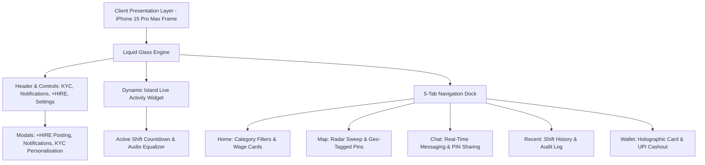

# Product Requirements Document (PRD)
## Project: PART-TIME — Liquid Glass Employer & Employee Marketplace

---

## 1. Executive Summary & Vision

### 1.1 Problem Statement
In India's fast-growing gig and hyper-local service economy, micro-employers (cafés, retail stores, event organizers, promotional agencies) face sudden, acute staffing shortages. Simultaneously, students, freelancers, and part-time workers require immediate, flexible earning opportunities without cumbersome multi-week recruitment hurdles. Existing job portals cater predominantly to corporate full-time contracts or long-term commitments, leaving daily, hourly, or emergency part-time shifts underserved.

### 1.2 Product Vision
**PART-TIME** is a real-time, hyper-local part-time talent and shift marketplace designed with an ultra-premium **Liquid Glassmorphism** visual identity. It bridges local business owners and flexible job seekers through immediate geo-located shift discovery, instant in-app communication, tamper-resistant one-time attendance verification (OTP check-in), and instant digital payouts.

---

## 2. Target Audience & User Personas

### 2.1 Persona A: The Job Seeker / Part-Time Worker (e.g., College Student / Freelancer)
- **Profile**: 18–25 years old, tech-savvy, mobile-first, looking to earn supplementary income during free hours or weekends.
- **Pain Points**:
  - Delayed payment cycles and lack of wage transparency.
  - Complex interview processes for simple hourly gigs.
  - Uncertainty about shift legitimacy and workplace safety.
- **Key Goals**: Discover nearby shifts paying transparent wages (₹100 to ₹10,000), verify shifts instantly via OTP, and withdraw earnings immediately to UPI / Google Pay.

### 2.2 Persona B: The Employer / Business Owner (e.g., Café Manager / Event Planner)
- **Profile**: Busy shop owner, event coordinator, or logistics manager facing last-minute no-shows or rush-hour surges.
- **Pain Points**:
  - Unreliable temporary staff and high cancellation rates.
  - Tedious paperwork and lack of quick identity verification.
- **Key Goals**: Post a vacancy in under 60 seconds with clear wage rates, verify worker arrival via a mutual handshake PIN, and automate payout release upon shift completion.

---

## 3. Product Architecture & System Overview



---

## 4. Functional Specifications

### 4.1 Identity, Personalisation & KYC
- **Mandatory Age Requirement**: Built-in verification threshold enforcing $\text{Age} \ge 18$ for legal compliance.
- **Profile Customisation**:
  - Profile avatar with live status indicator.
  - Dual-role switcher (**Worker / Job Seeker** vs. **Employer / Business**).
  - Skill tag selection (*Barista, Event Host, Cashier, Promoter, Inventory, Delivery*).
  - Minimum expected hourly rate preference.
  - Document status indicator (Aadhaar / ID Card verification checkmark).

### 4.2 Home Feed & Job Discovery
- **Live Search**: Instant keyword filtering across job titles, business names, categories, and locations.
- **Category Taxonomy**: Frosted horizontal scroll chips for quick categorization:
  - *All Opportunities*
  - *Café & Food*
  - *Promo & Sampling*
  - *Events & Ushers*
  - *Logistics & Warehouse*
  - *Retail & Stores*
  - *Express Delivery*
- **Wage Tier Cards**: Standardized high-contrast wage tiers derived from the original design blueprint:
  - **₹100**: Short micro-tasks (Flyer distribution, quick survey).
  - **₹500**: Half-day shifts (Café barista support, retail inventory sorting).
  - **₹1,000**: Full standard shifts (Event coordination, warehouse rush).
  - **₹10,000**: Multi-day / high-skill contracts (Weekend expo supervisor, corporate campaign lead).
- **Card Actions**:
  - Employer rating and distance calculation (e.g., `4.8 ★ • 1.2 km away`).
  - Required skills and shift duration tags.
  - **Apply Now** button: Instantly registers application and updates notification stream.
  - **Quick Chat** button: Deep links directly into the active chat session with the hiring manager.

### 4.3 On-Site Security & Handshake Verification (OTP 6767)
- **Handshake Protocol**: To prevent fraudulent check-ins and wage disputes, each booked shift generates an active **One-Time PIN** (universal prototype code: `OTP 6767`).
- **Check-in Workflow**:
  1. Worker arrives at the employer's physical location.
  2. Worker shares or displays the OTP in-app or via Quick Chat.
  3. Employer verifies the OTP to initiate the shift timer.
  4. Dynamic Island immediately activates the live shift tracker.

### 4.4 Interactive Map View
- **Radar Grid**: Real-time rotating scanning sweep centered on the user's geolocated position.
- **"You are Here" Beacon**: Animated pulsing concentric signal rings representing the user's live position.
- **Nearby Opportunity Pins**: Visual holographic pins indicating open positions with embedded price tags (₹100, ₹500, ₹1k, ₹10k).
- **Radius Filter Control**: Interactive range slider (1 km, 5 km, 10 km, 25 km).
- **Slide-up Sheet**: Tapping any map pin slides up an immediate contextual preview card with one-tap navigation and quick application.

### 4.5 In-App Communication (Chat)
- **Employer Directory**: Pre-populated with active employer conversations:
  - **Arun** (*Blue Tokai Café*) — Shift coordination & barista assistance.
  - **Akhila** (*Vogue Fashion Week*) — VIP event ushering.
  - **Ryan** (*QuickBite Logistics*) — Rapid sorting & delivery dispatch.
  - **Toby** (*TechX Global Expo*) — Multi-day booth supervision.
- **Dynamic Messaging Stream**:
  - Message status indicators (Sent, Delivered, Read).
  - Interactive Action Chips:
    - *"🔑 Share PIN 6767"*: Sends the check-in code and receives an automated confirmation acknowledgment.
    - *"💰 Request Pay"*: Requests shift wage release and triggers automatic wallet balance incrementation.
  - Audio & Call simulation trigger.

### 4.6 Shift History (Recent)
- Chronological timeline categorizing shifts by status:
  - **Completed**: Displaying settled amount, date, employer rating, and settlement receipt ID.
  - **Scheduled**: Showing upcoming start time, address, and shift PIN.
  - **Applied / Under Review**: Real-time status badge of pending employer reviews.

### 4.7 Holographic Wallet & Instant Cashout
- **Holographic Glass Card**: Specular card displaying current available balance (**₹1,000** baseline prototype balance) and linked UPI Virtual Payment Address (VPA).
- **Instant Cashout Modal**:
  - Integrated payment rails: **Google Pay (GPay)**, **PhonePe**, and **Paytm**.
  - Custom amount slider or quick-select chips (₹100, ₹500, ₹1,000, Full Balance).
  - Transaction fee: ₹0 (zero fee promotional tier).
  - Web Audio coin sound effect and celebratory confirmation modal upon transfer completion.

### 4.8 Employer "+ HIRE" Publishing Flow
- Accessible via the prominent `+ HIRE` button in the top navigation bar.
- Direct input modal capturing:
  - Job Title & Role Category.
  - Shift Date, Time, and Duration.
  - Wage Amount (INR ₹) and Payment Type (Per Hour / Per Shift).
  - Open Slots Count.
  - Required Skills and Location.
- Instant publication into both the Home job feed and Radar Map view without page reload.

### 4.9 Floating Liquid Glass Bottom Navigation Dock
- **Architecture**: Centered floating capsule tab bar (`max-w-[364px]`, `border-radius: 34px`) elevated above screen content with visible margins on both sides.
- **Glass Material & Inset Highlights**:
  - Translucent neutral backing: `rgba(255, 255, 255, 0.06)`
  - Frosted diffusion: `backdrop-filter: blur(24px) saturate(180%)` with `-webkit-backdrop-filter` fallback.
  - Precision hairline border: `1px solid rgba(255, 255, 255, 0.14)`
  - Lift and physical thickness: Outer shadow `0 8px 32px rgba(0,0,0,0.45)`, top inset reflection `inset 0 1px 1px rgba(255,255,255,0.25)`, and bottom shadow `inset 0 -1px 1px rgba(0,0,0,0.3)`.
  - Specular Curvature Line: 1px top sheen line (`transparent → rgba(255,255,255,0.45) → transparent`).
- **5-Tab Navigation Elements**:
  - Tabs: **Home**, **Map**, **Chat**, **Recent**, **Wallet** with ~58×52px touch targets and `26px` border radius.
  - Minimalist 1.8px-stroke line icons with tactile spring compression on press (`active:scale-90`).
  - Inactive tabs rendered in dim gray (`50%` opacity).
  - Active state sliding capsule in solid white/light-gray with soft radial glow (`box-shadow: 0 0 16px rgba(255,255,255,0.35), 0 2px 8px rgba(0,0,0,0.25)`) and contrasting dark iconography.
  - Chat notification dot badge (`5px` diameter red indicator `#ef4444` at the base of the Chat icon).

---

## 5. UI/UX Design System & Theme Specification

### 5.1 The Liquid Glassmorphism Philosophy
- **Physical Specularity**: Realistic light reflection edges created through layered linear gradients:
  `linear-gradient(135deg, rgba(255, 255, 255, 0.15) 0%, rgba(255, 255, 255, 0.03) 100%)`
- **Dynamic Multi-Layer Mesh**: Floating, fluid organic orbs drifting in the background to supply refractive depth for all frosted panels.
- **Glass Beveling**: Outer border strokes with 1px semi-transparent white borders (`rgba(255, 255, 255, 0.18)`).

### 5.2 Color Palettes & Modes

| Token | Black Crystal Theme (Default) | Light Crystal Theme |
| :--- | :--- | :--- |
| **Canvas Background** | `#000000` (Pure Pitch Black Onyx) | `#f0f3f8` (Soft Daylight Alabaster) |
| **Glass Surface** | `rgba(18, 18, 22, 0.65)` | `rgba(255, 255, 255, 0.65)` |
| **Glass Border** | `rgba(255, 255, 255, 0.14)` | `rgba(255, 255, 255, 0.80)` |
| **Primary Text** | `#ffffff` | `#0f172a` |
| **Muted Text** | `#8e95a5` | `#64748b` |
| **Accent Glow** | Cyan (`#00f0ff`) & Purple (`#8a2be2`) | Sapphire (`#0284c7`) & Indigo (`#6366f1`) |
| **Success / Verified** | Emerald Neon (`#00ff88`) | Mint Forest (`#059669`) |

### 5.3 iPhone 15 Pro Max Chassis & Dynamic Island
- **Chassis Dimensions**: Scaled proportional 430px × 932px viewport encased in a Titanium frame (`#28282b`) with 54px corner radiuses.
- **Physical Buttons**: Interactive Action Button, Volume Up/Down, and Power button that provide tactile CSS pressed transitions and synthetic haptic audio.
- **iOS 18 Status Bar**: Real-time updating clock (`9:41`), 5G network icon, cellular signal bars, and battery indicator.
- **Interactive Dynamic Island**:
  - Normal state: Compact 125px pill housing camera sensor and status dot.
  - Expanded state: Tapping expands into a 350px Live Activity card displaying current shift countdown (`"Arun's Cafe • In 35m • PIN 6767"`) and an animated procedural equalizer.

---

## 6. Performance & Non-Functional Requirements

### 6.1 Performance Benchmarks
- **Target Framerate**: Guaranteed **30 to 60+ FPS** across all devices, including budget Android/iOS mobile devices and integrated Intel/AMD laptop graphics.
- **Fill-Rate Optimization**: Standard frosted glass blurs of 40–60px create massive GPU fill-rate stalls on low-end hardware. PART-TIME utilizes an optimized **18px Gaussian blur** with hardware layer promotion, slashing GPU fill-rate compute by ~70% while maintaining visual fidelity.
- **GPU Compositor Acceleration**: All fluid mesh and orb animations utilize `transform: translate3d(x, y, 0)` combined with `will-change: transform` to bypass CPU geometry calculations and main-thread reflows.
- **Layout Containment**: Intensive interactive components (e.g. `.job-card`, `#screen-container`) enforce `contain: layout style paint;` to prevent layout thrashing during scroll events.
- **Zero Runtime Dependencies**: The core client requires 0 MB of external frameworks, libraries, or npm packages, running completely on native browser web APIs.

### 6.2 Security & Compliance
- **KYC & Age Gate**: Mandatory client-side age confirmation ($\ge 18$) before application submission.
- **OTP Verification**: Mutual handshake code ensures neither party can trigger payment settlement without physical presence.
- **Safe Monetary Encoding**: All monetary figures use ISO standard Unicode Indian Rupee representations (`\u20B9` / `&#8377;`) to eliminate cross-platform character corruption.

---

## 7. Data Models & Schemas

### 7.1 Job Entity
```typescript
interface JobVacancy {
  id: string;
  title: string;
  employer: string;
  employerAvatar: string;
  rating: number;
  reviewsCount: number;
  category: 'cafe' | 'promo' | 'events' | 'logistics' | 'retail' | 'delivery';
  wage: number;             // e.g. 100, 500, 1000, 10000
  wagePeriod: 'hour' | 'shift' | 'contract';
  distanceKm: number;
  location: string;
  timeSlot: string;
  urgent: boolean;
  pinCode: string;          // e.g. '6767'
  description: string;
  requirements: string[];
}
```

### 7.2 User Profile Entity
```typescript
interface UserProfile {
  id: string;
  name: string;
  role: 'employee' | 'employer';
  ageVerified: boolean;
  kycStatus: 'verified' | 'pending' | 'unverified';
  avatarUrl: string;
  skills: string[];
  minHourlyRate: number;
  walletBalance: number;    // e.g. 1000
  upiId: string;
}
```

### 7.3 Transaction Entity
```typescript
interface WalletTransaction {
  id: string;
  jobId?: string;
  type: 'credit' | 'debit';
  amount: number;
  timestamp: string;
  description: string;
  paymentRail: 'UPI' | 'GPay' | 'PhonePe' | 'Paytm';
  status: 'completed' | 'processing' | 'failed';
}
```

---

## 8. Phased Development Roadmap

### Phase 1: Interactive Prototype & Design System (Delivered ✅)
- [x] Pure Liquid Glass & Black Crystal styling with theme switcher.
- [x] iPhone 15 Pro Max showcase frame with interactive Dynamic Island and hardware buttons.
- [x] Full hand-drawn sketch parity: Wage tiers (₹100, ₹500, ₹1k, ₹10k), Categories, KYC badge.
- [x] 5-Tab navigation dock (Home, Radar Map, Real-time Chat, Recent, Wallet).
- [x] OTP 6767 check-in logic and UPI / GPay cashout simulation.
- [x] 60 FPS GPU-accelerated performance architecture for low-end hardware.
- [x] Zero-dependency local server (`serve.ps1`) and standalone distribution (`standalone.html`).
- [x] GitHub repository synchronization (`RyanMathew07/Part-time-`).

### Phase 2: Production Backend & Real-Time Sync (Next)
- [ ] Node.js / Go REST & WebSocket API for real-time chat and shift status synchronization.
- [ ] PostgreSQL / Firestore database persistence for jobs, user profiles, and check-in logs.
- [ ] Native Geolocation API integration with Google Maps / Mapbox raster tiles.
- [ ] Automated SMS / Push notification dispatch for OTP delivery.

### Phase 3: Payment Gateway & Escrow
- [ ] Razorpay / Cashfree UPI integration for real money payouts and employer escrow deposits.
- [ ] Automated wage release on OTP confirmation + employer shift sign-off.
- [ ] Government ID verification via Digilocker / Aadhaar API.

### Phase 4: Native App Store Release
- [ ] Packaging via Capacitor / Tauri or Flutter native build for Google Play Store and Apple App Store.
- [ ] Biometric Face ID / Fingerprint check-in verification.
- [ ] Employer multi-location management dashboard.
